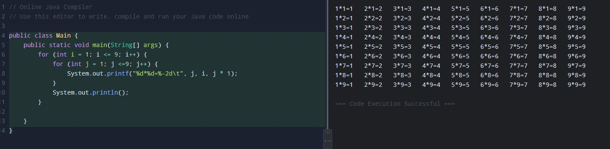
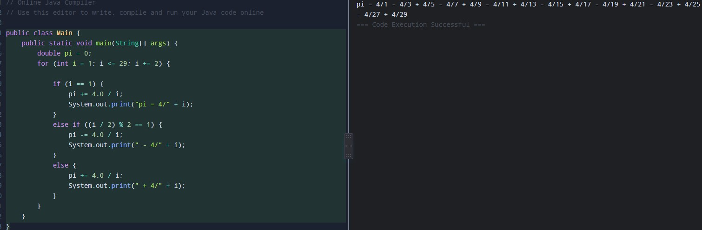
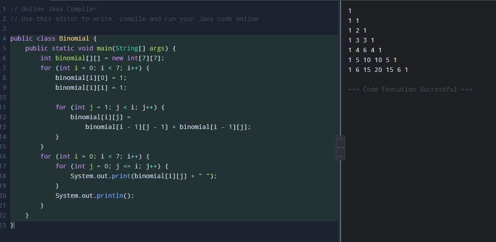
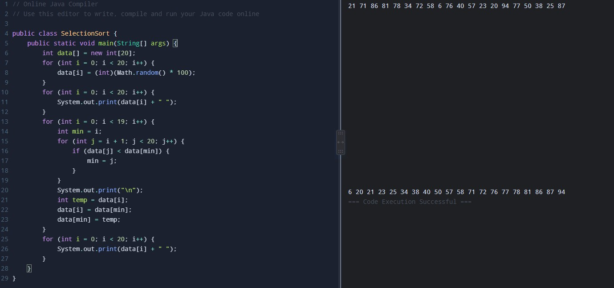
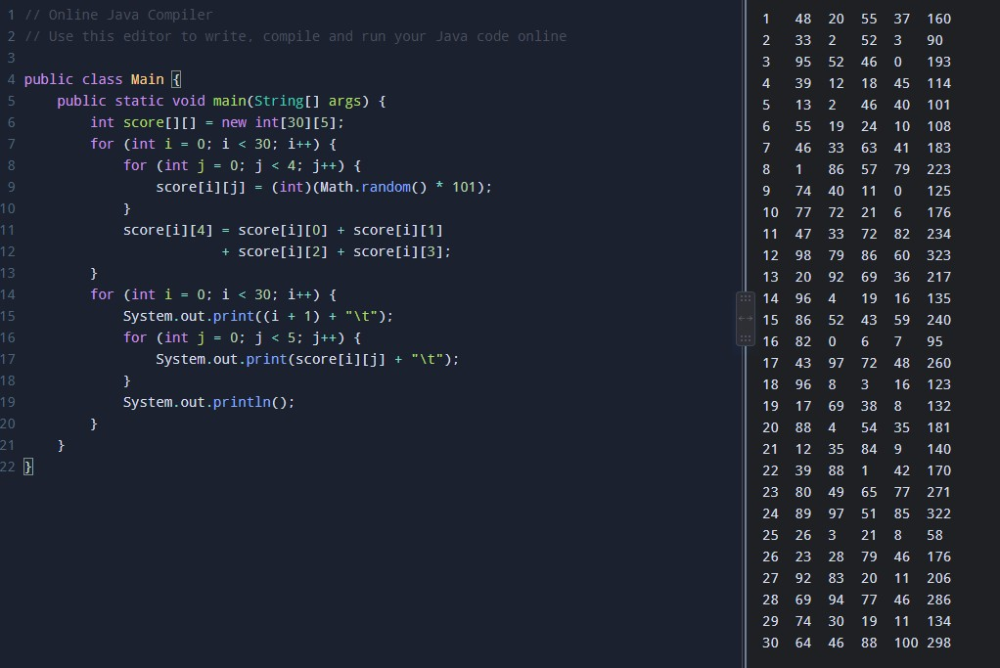

# OOP2026
### Homework1
```java
public class hellowold {
	 public static void main(String []args){
		 int i , j; 
		 for(i=0; i<10; i++) {
			  for(j=0; j<=i; j++) {
			    System.out.print("#");
			  }
			  for(; j<=10; j++) {
			    System.out.print(" ");
			  }
			  System.out.println();
			}
		 for(i=0; i<=10; i++) {
			  for(j=0; j<=10-i; j++) {
			    System.out.print("#");
			  }
			  for(; j<=10; j++) {
			    System.out.print(" ");
			  }
			  System.out.println();
			}
		 for(i=0; i<10; i++) {
			  for(j=0; j<=10-i; j++) {
			    System.out.print(" ");
			  }
			  for(; j<=10; j++) {
			    System.out.print("#");
			  }
			  System.out.println();
			}
		 for(i=0; i<=10; i++) {
			  for(j=0; j<=i; j++) {
			    System.out.print(" ");
			  }
			  for(; j<=10; j++) {
			    System.out.print("#");
			  }
			  System.out.println();
			}
}
}
```


### Homework2
```java
public class Main {
    public static void main(String[] args) {
        int a = 1;
        int b = 1;
        for(int i=1; i<=20; i++) {
            System.out.print(a + " ");
            int next = a + b;
            a = b;
            b = next; 
        }
    }
}
```


### Homework3
```java
public class Main {
    public static void main(String[] args) {
        int a = 1;
        int b = 2;
        for (int i = 1; i <= 20; i++) {
             System.out.println(b + "/" + a + " = " + (double)b / a);
            
            int temp = a + b;
            a = b;
            b = temp;
        }
    }
}
```


### Homework4
```java
public class Main {
    public static void main(String[] args) {
        for (int i = 1; i <= 9; i++) {
            for (int j = 1; j <=9; j++) {
                System.out.printf("%d*%d=%-2d\t", j, i, j * 1);
            }
            System.out.println();
        }
       
    }
}
```


### Homework5
```java
public class Main {
    public static void main(String[] args) {
        double pi = 0;
        for (int i = 1; i <= 29; i += 2) {

            if (i == 1) {
                pi += 4.0 / i;
                System.out.print("pi = 4/" + i);
            } 
            else if ((i / 2) % 2 == 1) {
                pi -= 4.0 / i;
                System.out.print(" - 4/" + i);
            } 
            else {
                pi += 4.0 / i;
                System.out.print(" + 4/" + i);
            }
        }
    }
}
```


### Homework6
```java
public class Binomial {
    public static void main(String[] args) {
        int binomial[][] = new int[7][7];
        for (int i = 0; i < 7; i++) {
            binomial[i][0] = 1;
            binomial[i][i] = 1;

            for (int j = 1; j < i; j++) {
                binomial[i][j] =
                    binomial[i - 1][j - 1] + binomial[i - 1][j];
            }
        }
        for (int i = 0; i < 7; i++) {
            for (int j = 0; j <= i; j++) {
                System.out.print(binomial[i][j] + " ");
            }
            System.out.println();
        }
    }
}
```


### Homework7
```java
public class SelectionSort {
    public static void main(String[] args) {
        int data[] = new int[20];
        for (int i = 0; i < 20; i++) {
            data[i] = (int)(Math.random() * 100);
        }
        for (int i = 0; i < 20; i++) {
            System.out.print(data[i] + " ");
        }
        for (int i = 0; i < 19; i++) {
            int min = i;
            for (int j = i + 1; j < 20; j++) {
                if (data[j] < data[min]) {
                    min = j;
                }
            }
            System.out.print("\n");
            int temp = data[i];
            data[i] = data[min];
            data[min] = temp;
        }
        for (int i = 0; i < 20; i++) {
            System.out.print(data[i] + " ");
        }
    }
}
```


### Homework8
```java
public class Main {
    public static void main(String[] args) {
        int score[][] = new int[30][5];
        for (int i = 0; i < 30; i++) {
            for (int j = 0; j < 4; j++) {
                score[i][j] = (int)(Math.random() * 101);
            }
            score[i][4] = score[i][0] + score[i][1]
                        + score[i][2] + score[i][3];
        }
        for (int i = 0; i < 30; i++) {
            System.out.print((i + 1) + "\t");
            for (int j = 0; j < 5; j++) {
                System.out.print(score[i][j] + "\t");
            }
            System.out.println();
        }
    }
}
```


### Homework9
```
1.625 = 1.11  
1.562 = 1.101 
1.875 = 0.111 
0.875 = 0.111
13.875 = 1101.111
45.875 = 101101.111
1.9 = 1.1110011001100110011
1.1 = 1.0001100110011001101
```

### Homework12
```
72  = 1001000
-72 = 0111000
```

