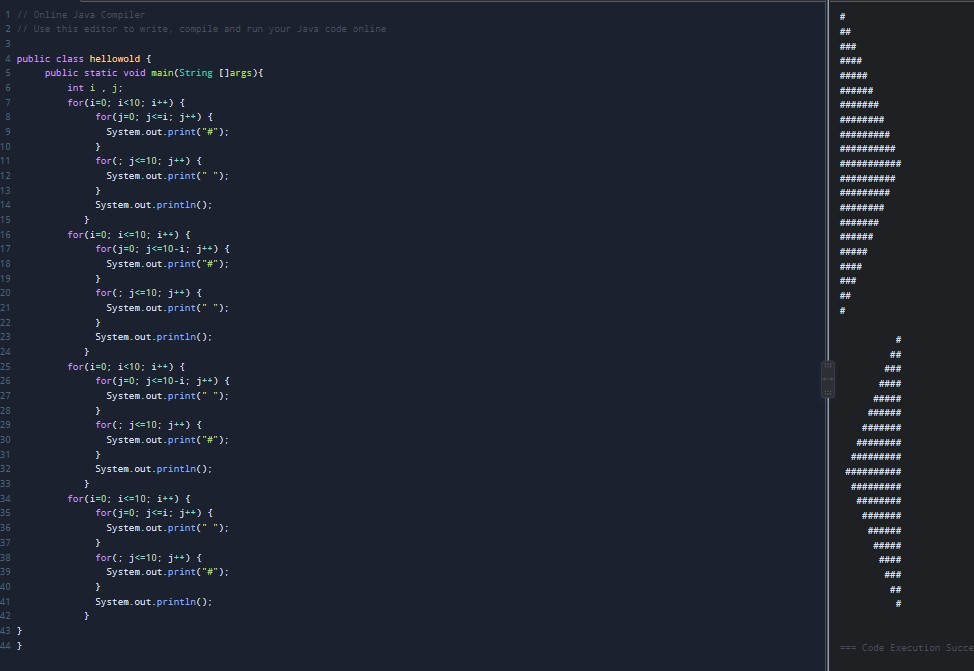
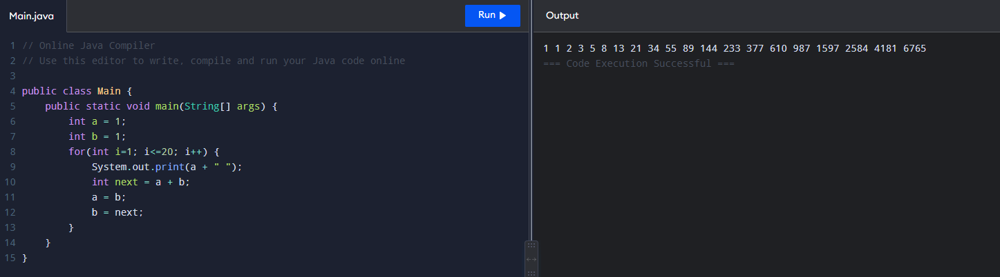
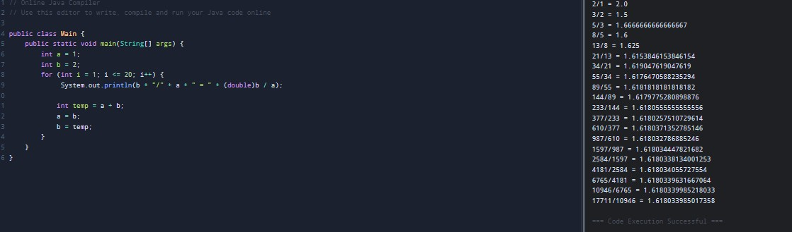

# OOP2026
### Homework1
```java
public class hellowold {
	 public static void main(String []args){
		 int i , j; 
		 for(i=0; i<10; i++) {
			  for(j=0; j<=i; j++) {
			    System.out.print("#");
			  }
			  for(; j<=10; j++) {
			    System.out.print(" ");
			  }
			  System.out.println();
			}
		 for(i=0; i<=10; i++) {
			  for(j=0; j<=10-i; j++) {
			    System.out.print("#");
			  }
			  for(; j<=10; j++) {
			    System.out.print(" ");
			  }
			  System.out.println();
			}
		 for(i=0; i<10; i++) {
			  for(j=0; j<=10-i; j++) {
			    System.out.print(" ");
			  }
			  for(; j<=10; j++) {
			    System.out.print("#");
			  }
			  System.out.println();
			}
		 for(i=0; i<=10; i++) {
			  for(j=0; j<=i; j++) {
			    System.out.print(" ");
			  }
			  for(; j<=10; j++) {
			    System.out.print("#");
			  }
			  System.out.println();
			}
}
}
```


### Homework2
```java
public class Main {
    public static void main(String[] args) {
        int a = 1;
        int b = 1;
        for(int i=1; i<=20; i++) {
            System.out.print(a + " ");
            int next = a + b;
            a = b;
            b = next; 
        }
    }
}
```


### Homework3
```java
public class Main {
    public static void main(String[] args) {
        int a = 1;
        int b = 2;
        for (int i = 1; i <= 20; i++) {
             System.out.println(b + "/" + a + " = " + (double)b / a);
            
            int temp = a + b;
            a = b;
            b = temp;
        }
    }
}
```

